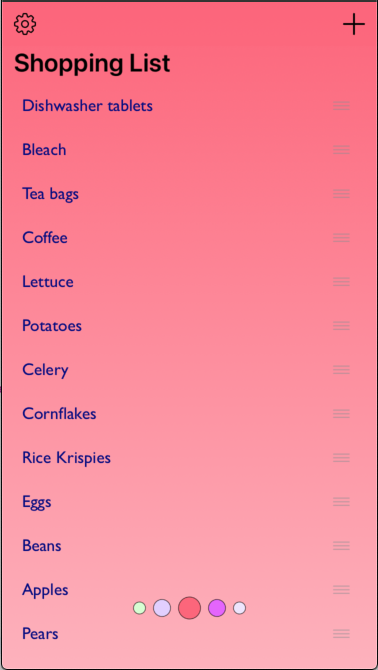
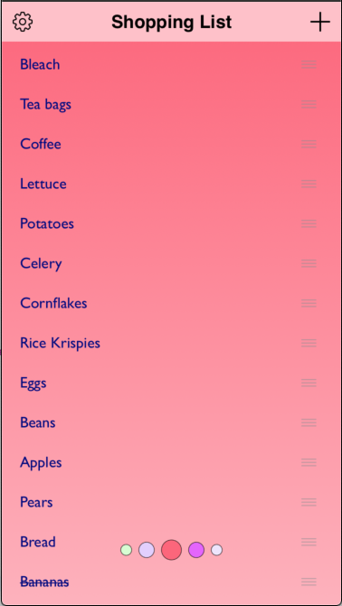
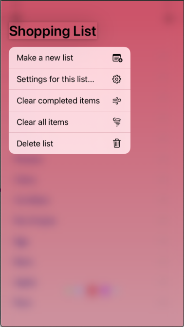

# Listy

A replacement for SwiftUI List, which offers a number of benefits & customisation options

  

## Installation

### Swift Package Manager

In Xcode:
* File ⭢ Swift Packages ⭢ Add Package Dependency...
* Use the URL https://github.com/franklynw/Listy


## Example

> **NB:** All examples require `import Listy` at the top of the source file

```swift
var body: some View {

    ZStack {
        Listy(viewModel)
            .title(viewModel.title, color: viewModel.titleColor)
            .titleBarColor(viewModel.titleBarColor)
            .titleMenuItems(viewModel.titleBarContextMenuItems)
            .leftBarItem(.menu(menuItems: viewModel.leftBarItemContextMenuItems, iconName: Image.SystemName.ellipsis))
            .rightBarItem(.button(iconName: Image.SystemName.plus, action: viewModel.addItem))
            .allowsRowDragToReorder(viewModel.canReorderRows)
            .onTapped(viewModel.completeItem)
            .itemContextMenuItems(viewModel.itemContextMenuItems)
            .refresh(viewModel.reloadTable)
    }
    .actionSheet(isPresented: $isShowingActionSheet) {
        ActionSheet(
            title: Text("Settings"),
            message: nil,
            buttons: viewModel.settingsButtons()
        )
    }
}
```

### Initialise

```swift
public init(_ viewModel: DataSource)
```

The viewModel must conform to the ListyDataSource protocol, and the list items to the ListyIdentifiableView protocol


### Set the title

You can provide a title for the list, which will make it appear like the example images at the top. If no title is provided, it appears as a list only. The parameters are bindings to model vars

```swift
Listy(viewModel)
    .title(viewModel.title, color: viewModel.titleColor)
```

### Set the title bar colour

If you provide a title, you can set the colour of the title bar. If no title is provided and you use this, nothing will happen. The parameter is a binding to a model var

```swift
Listy(viewModel)
    .title(viewModel.title, color: viewModel.titleColor) // the title is needed or it's a no-op
    .titleBarColor(viewModel.titleBarColor)
```

### Provide title context menu items

If you provide a title, you can also give it a context menu. If no title is provided and you use this, nothing will happen

```swift
Listy(viewModel)
    .title(viewModel.title, color: viewModel.titleColor) // the title is needed or it's a no-op
    .titleMenuItems(viewModel.titleBarContextMenuItems)
```

### Left and right "barButtonItems"

If you provide a title, you can also have left & right bar buttons. If no title is provided and you use this, nothing will happen

```swift
Listy(viewModel)
    .title(viewModel.title, color: viewModel.titleColor) // the title is needed or it's a no-op
    .leftBarItem(.menu(menuItems: viewModel.leftBarItemContextMenuItems, iconName: Image.SystemName.ellipsis))
    .rightBarItem(.button(iconName: Image.SystemName.plus, action: viewModel.addItem))
```

You have the option of adding the item as a button or as a menu, as shown above

### Enable or disable row reordering by dragging

This can be switched on or off, with a binding to the model Bool var

```swift
Listy(viewModel)
    .allowsRowDragToReorder(viewModel.canReorderRows)
```

### Item moved action

Will be invoked after an item has been dragged & reordered

```swift
Listy(viewModel)
    .onMove {
        viewModel.itemMoved($0, $1)
    }
```

### Item tapped action

Invoked when an item is tapped

```swift
Listy(viewModel)
    .onTapped(viewModel.completeItem)
```

### Item context menus

Provide context menus for items in the list

```swift
Listy(viewModel)
    .itemContextMenuItems(viewModel.itemContextMenuItems)
```

### Force list refresh

If the viewModel toggles the refresh Bool, the list will be redrawn

```swift
Listy(viewModel)
    .refresh(viewModel.reloadTable)
```

## ListyContextMenuItem

This is the struct used to define context menu items for the list & title. It has various options -

### Initialise as an "action" row

```swift
public init(title: String, systemImage: String? = nil, shouldAppear: ((String) -> Bool)? = nil, action: @escaping (String) -> ())
```

* title - the menu item's title
* systemImage - the systemName of the icon for the menu item, if none is provided there will be no icon
* shouldAppear - a closure which lets you control whether or not the menu item should be shown
* action - invoked when the menu item is selected

### Initialise as a "sub-menu" row

```swift
public init(title: String, systemImage: String? = nil, shouldAppear: ((String) -> Bool)? = nil, subMenuItems: @escaping (String) -> [ListyContextMenuItem])
```

* title - the menu item's title
* systemImage - the systemName of the icon for the menu item, if none is provided there will be no icon
* shouldAppear - a closure which lets you control whether or not the menu item should be shown
* subMenuItems - an array of ListyContextMenuItems for the sub-menu


## Dependencies

Requires -

* SwiftUITrackableScrollView, which is linked. Take a look at it [here](https://github.com/maxnatchanon/trackable-scroll-view)
* FWCommonProtocols, which is linked. GitHub page is [here](https://github.com/franklynw/FWCommonProtocols)


## Issues

There is one annoying issue (so far!) where if you drag to reorder, but release the item before moving it, the highlighted row remains highlighted. If anyone can figure out how to solve this, I'll be really happy...


## License  

`Listy` is available under the MIT license
